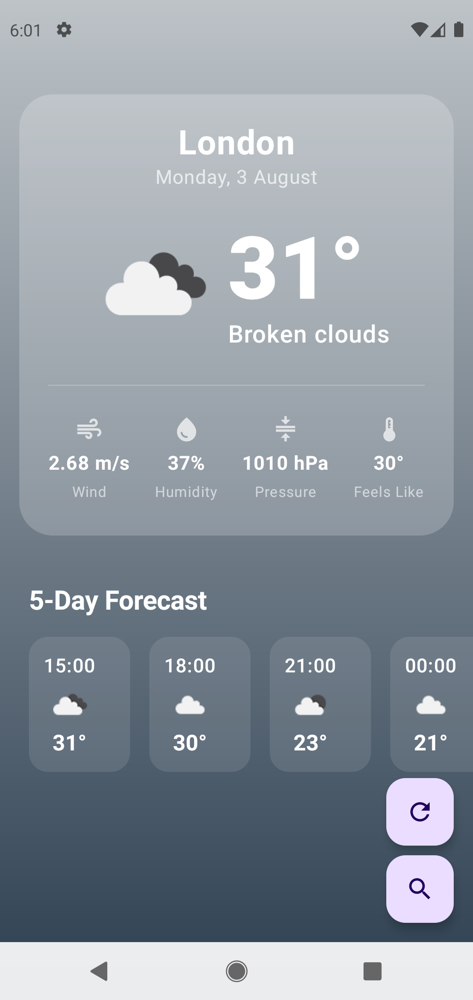
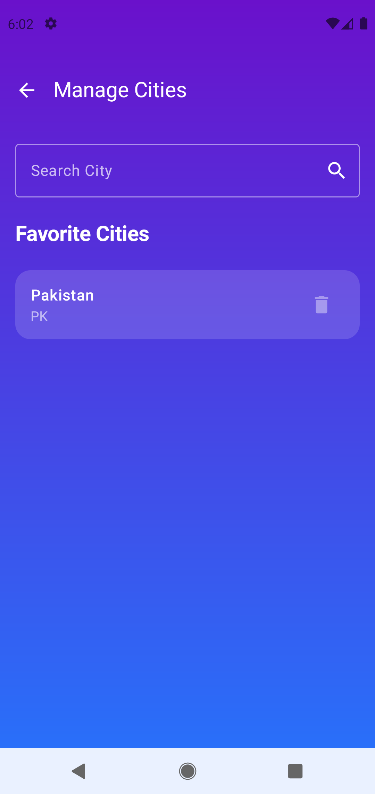
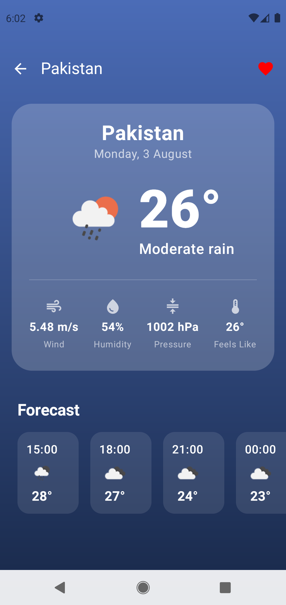

# 🌦️ Weather App

A modern Android Weather application built using **Kotlin** and **Jetpack Compose**, following the **MVVM Architecture**. The app provides real-time weather information, including current weather conditions, hourly forecasts, and upcoming weather updates using a weather API.

---

## ✨ Features

- 🌍 Search Weather by City
- ☀️ Current Weather Conditions
- 🌡 Temperature, Humidity & Wind Speed
- 🌧 Weather Description & Icons
- 🕒 Hourly Forecast
- 📅 Multi-Day Weather Forecast
- 🔄 Pull to Refresh Weather Data
- 🌐 Fetch Live Weather using REST API
- 🎨 Material 3 UI
- 📱 Responsive Jetpack Compose Interface

---

## 🛠 Tech Stack

- Kotlin
- Jetpack Compose
- MVVM Architecture
- Retrofit
- Gson Converter
- Hilt (Dependency Injection)
- Navigation Compose
- Coroutines
- Material 3

---

## 📂 Project Structure

```text
app
│
├── data
│   ├── remote
│   └── repository
│
├── presentation
│   ├── components
│   ├── navigation
│   ├── screens
│   └── viewmodel
│
├── di
│
└── MainActivity.kt
```

---

## 📱 Screenshots

### Home Screen


### Search Screen


### Favorites Screen


---

## 🚀 How to Run

1. Clone this repository.
2. Open the project in Android Studio.
3. Sync Gradle.
4. Add your Weather API key if required.
5. Run the application on an emulator or Android device.

---

## 📚 What I Learned

During this project I learned:

- REST API Integration
- Retrofit Networking
- JSON Parsing
- MVVM Architecture
- Jetpack Compose UI Development
- Hilt Dependency Injection
- Navigation Compose
- Coroutines
- State Management
- Modern Android Development

---

## 🔮 Future Improvements

- 📍 Current Location Weather
- ⭐ Favorite Cities
- 🌙 Dark Mode
- ⏰ Weather Alerts
- 🌦 7-Day Forecast
- 🗺 Interactive Weather Map
- 🌡 Unit Conversion (°C / °F)

---

## 👨‍💻 Author

**Muhib Dawar**

Software Engineering Student

Learning Modern Android Development with Kotlin & Jetpack Compose.
